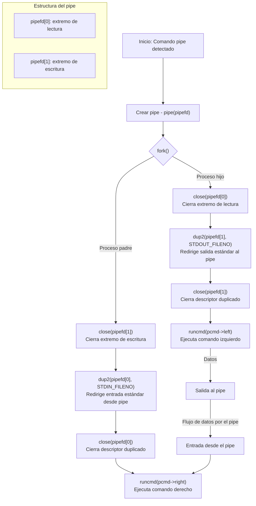

### Explicación del flujo de datos
1. Creación del pipe:
   - `pipe(pipefd)` crea un canal de comunicación con dos extremos
   - `pipefd[0]`: Extremo de lectura
   - `pipefd[1]`: Extremo de escritura

2. Bifurcación con `fork()`:
   - Se crea un proceso hijo idéntico al padre

3. En el proceso hijo:
   - Cierra el extremo de lectura (no lo necesita)
   - Redirige su salida estándar (STDOUT) al extremo de escritura del pipe
   - Cierra el descriptor duplicado
   - Ejecuta el comando izquierdo (cmd1)
  
4. En el proceso padre:
   - Cierra el extremo de escritura (no lo necesita)
   - Redirige su entrada estándar (STDIN) desde el extremo de lectura del pipe
   - Cierra el descriptor duplicado
   - Ejecuta el comando derecho (cmd2)
  
5. Flujo de datos:
   - La salida de `cmd1` (ejecutado por el hijo) se escribe en el pipe
   - La entrada de `cmd2` (ejecutado por el padre) se lee desde el pipe

De esta manera, se conecta la salida del primer comando con la entrada del segundo comando, implementando el operador de tubería (`|`) de la shell.