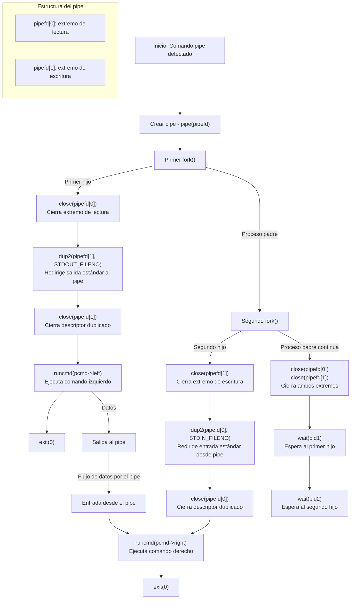

## Explicación del flujo de datos

1. **Creación del pipe**: 
   - `pipe(pipefd)` crea un canal de comunicación con dos extremos
   - `pipefd[0]`: Extremo de lectura
   - `pipefd[1]`: Extremo de escritura

2. **Creación del primer hijo con `fork()`**:
   - El primer hijo se encarga del comando izquierdo
   - Cierra el extremo de lectura (`pipefd[0]`) ya que solo necesita escribir
   - Redirige su salida estándar (STDOUT) al extremo de escritura del pipe
   - Cierra el descriptor duplicado (ya no necesita el original)
   - Ejecuta el comando izquierdo (`cmd1`)
   - Toda la salida generada por `cmd1` va directamente al pipe

3. **Creación del segundo hijo con `fork()`**:
   - El segundo hijo se encarga del comando derecho
   - Cierra el extremo de escritura (`pipefd[1]`) ya que solo necesita leer
   - Redirige su entrada estándar (STDIN) desde el extremo de lectura del pipe
   - Cierra el descriptor duplicado (ya no necesita el original)
   - Ejecuta el comando derecho (`cmd2`)
   - Toda la entrada que necesita `cmd2` la lee desde el pipe

4. **Proceso padre**:
   - Cierra ambos extremos del pipe, ya que no los utiliza
   - Espera a que terminen ambos procesos hijos con `wait`
   - En esta implementación, actúa solo como coordinador

5. **Flujo de datos**:
   - La salida de `cmd1` (ejecutado por el primer hijo) se escribe en el pipe
   - La entrada de `cmd2` (ejecutado por el segundo hijo) se lee desde el pipe
   - Los datos fluyen directamente entre los dos procesos hijos sin intervención del padre

### Diferencias con la implementación anterior
   1. En la versión anterior, el proceso padre ejecutaba el comando derecho.
   2. En esta nueva implementación, el proceso padre crea dos hijos y cada uno ejecuta un comando.
   3. El proceso padre solo se encarga de crear el pipe, los procesos y esperar a que terminen.
   4. Esta implementación permite que el proceso padre pueda hacer otras tareas mientras los hijos ejecutan los comandos.